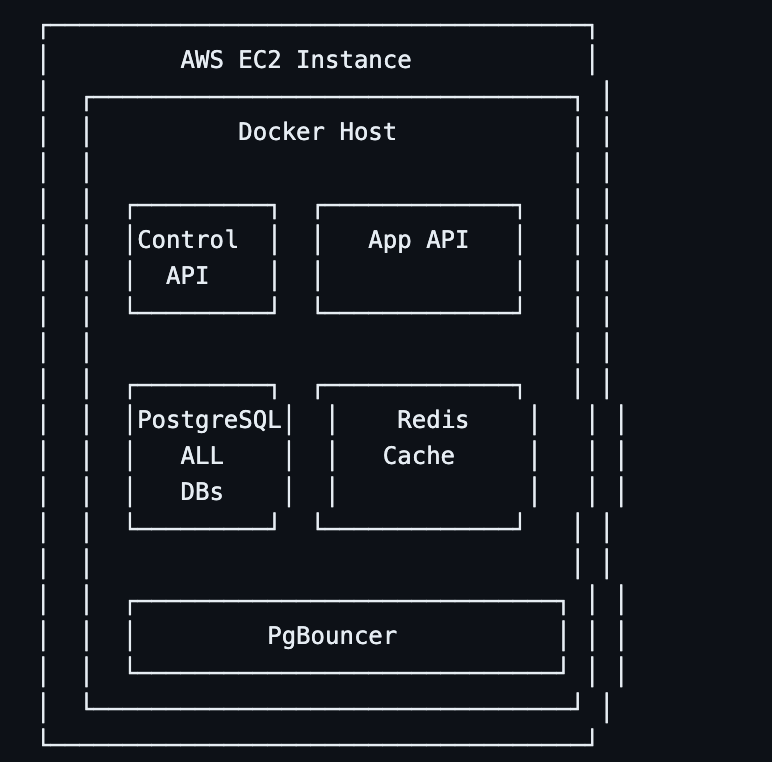

#!/bin/bash

# scripts/deploy-ec2.sh

# ════════════════════════════════════════════════════

# 🚀 DÉPLOIEMENT MVP SUR EC2

# ════════════════════════════════════════════════════

set -e

SERVER_IP=${1:-"your-ec2-ip"}
SERVER_USER=${2:-"ubuntu"}
KEY_PATH=${3:-"~/.ssh/your-key.pem"}

echo "🚀 Déploiement sur EC2: ${SERVER_IP}"

# ════════════════════════════════════════════════════

# 📦 1. PREPARATION DES FICHIERS

# ════════════════════════════════════════════════════

# Créer le package de déploiement

echo "📦 Création du package..."
tar -czf helpdeskly-deploy.tar.gz \
 docker-compose.prod.yml \
 .env.production \
 Dockerfile \
 dist/ \
 prisma/ \
 package.json \
 scripts/

# ════════════════════════════════════════════════════

# 🔄 2. TRANSFERT VERS EC2

# ════════════════════════════════════════════════════

echo "📤 Transfert vers EC2..."
scp -i ${KEY_PATH} helpdeskly-deploy.tar.gz ${SERVER_USER}@${SERVER_IP}:/tmp/

# ════════════════════════════════════════════════════

# ⚙️ 3. INSTALLATION SUR EC2

# ════════════════════════════════════════════════════

ssh -i ${KEY_PATH} ${SERVER_USER}@${SERVER_IP} << 'EOF'
set -e

echo "🔧 Installation des dépendances..."

# Mise à jour système

sudo apt update && sudo apt upgrade -y

# Installation Docker

if ! command -v docker &> /dev/null; then
curl -fsSL https://get.docker.com -o get-docker.sh
sudo sh get-docker.sh
sudo usermod -aG docker $USER
fi

# Installation Docker Compose

if ! command -v docker-compose &> /dev/null; then
sudo curl -L "https://github.com/docker/compose/releases/latest/download/docker-compose-$(uname -s)-$(uname -m)" -o /usr/local/bin/docker-compose
sudo chmod +x /usr/local/bin/docker-compose
fi

# Créer répertoire app

sudo mkdir -p /opt/helpdeskly
sudo chown $USER:$USER /opt/helpdeskly
cd /opt/helpdeskly

# Extraire les fichiers

tar -xzf /tmp/helpdeskly-deploy.tar.gz

echo "✅ Installation terminée"
EOF

# ════════════════════════════════════════════════════

# 🚢 4. DÉPLOIEMENT

# ════════════════════════════════════════════════════

ssh -i ${KEY_PATH} ${SERVER_USER}@${SERVER_IP} << 'EOF'
cd /opt/helpdeskly

echo "🚢 Démarrage des services..."

# Arrêter les anciens containers

docker-compose -f docker-compose.prod.yml down || true

# Démarrer les nouveaux

docker-compose -f docker-compose.prod.yml up -d

# Attendre que les services soient prêts

sleep 30

# Vérifier les services

echo "🏥 Vérification des services..."
curl -f http://localhost:6500/health && echo "✅ Control API: OK"
curl -f http://localhost:6501/health && echo "✅ App API: OK"

echo "🎉 Déploiement terminé!"
echo "🌐 Control API: http://${HOSTNAME}:6500"
echo "🌐 App API: http://${HOSTNAME}:6501"
EOF

echo "🎯 Déploiement EC2 terminé avec succès!"

# docker-compose.prod.yml

version: "3.9"

services:

# ════════════════════════════════════════════════════

# 🗄️ POSTGRESQL - TOUTES LES BASES

# ════════════════════════════════════════════════════

postgres:
image: postgres:16-alpine
container_name: helpdeskly-postgres
restart: unless-stopped
ports: - "5432:5432"
environment:
POSTGRES_USER: ${POSTGRES_USER:-helpdeskly}
POSTGRES_PASSWORD: ${POSTGRES_PASSWORD}
POSTGRES_DB: postgres # ✅ Optimisations pour EC2
POSTGRES_INITDB_ARGS: "--auth-host=scram-sha-256"
volumes: - postgres_data:/var/lib/postgresql/data - ./init-db.sql:/docker-entrypoint-initdb.d/init-db.sql - ./postgresql.conf:/etc/postgresql/postgresql.conf
command: >
postgres
-c config_file=/etc/postgresql/postgresql.conf
-c shared_buffers=256MB
-c effective_cache_size=1GB
-c maintenance_work_mem=64MB
-c checkpoint_completion_target=0.7
-c wal_buffers=16MB
-c default_statistics_target=100
-c random_page_cost=1.1
-c effective_io_concurrency=200
-c max_connections=200
networks: - helpdeskly-network
healthcheck:
test: ["CMD-SHELL", "pg_isready -U ${POSTGRES_USER:-helpdeskly}"]
interval: 10s
timeout: 5s
retries: 5

# ────────────────────────────────────────────────────

# 🔗 PGBOUNCER - CONNECTION POOLING

# ────────────────────────────────────────────────────

pgbouncer:
image: edoburu/pgbouncer:latest
container_name: helpdeskly-pgbouncer
restart: unless-stopped
ports: - "6432:6432"
environment:
DATABASE_URL: postgres://${POSTGRES_USER:-helpdeskly}:${POSTGRES_PASSWORD}@postgres:5432/postgres
AUTH_USER: ${POSTGRES_USER:-helpdeskly}
AUTH_PASSWORD: ${POSTGRES_PASSWORD} # ✅ Configuration optimisée EC2
POOL_MODE: transaction
MAX_CLIENT_CONN: 1000
DEFAULT_POOL_SIZE: 25
RESERVE_POOL_SIZE: 5
RESERVE_POOL_TIMEOUT: 5
MAX_DB_CONNECTIONS: 50
SERVER_RESET_QUERY: DISCARD ALL
SERVER_CHECK_DELAY: 30
depends_on:
postgres:
condition: service_healthy
networks: - helpdeskly-network
healthcheck:
test: ["CMD", "nc", "-z", "localhost", "6432"]
interval: 30s
timeout: 10s
retries: 3

# ────────────────────────────────────────────────────

# 🔴 REDIS - CACHE & SESSIONS

# ────────────────────────────────────────────────────

redis:
image: redis:7-alpine
container_name: helpdeskly-redis
restart: unless-stopped
ports: - "6379:6379"
volumes: - redis_data:/data - ./redis.conf:/etc/redis/redis.conf
command: redis-server /etc/redis/redis.conf
networks: - helpdeskly-network
healthcheck:
test: ["CMD", "redis-cli", "ping"]
interval: 10s
timeout: 5s
retries: 5

# ════════════════════════════════════════════════════

# 🎛️ CONTROL API

# ════════════════════════════════════════════════════

control-api:
build:
context: .
dockerfile: Dockerfile
target: control-api
container_name: helpdeskly-control-api
restart: unless-stopped
ports: - "6500:6500"
environment:
NODE_ENV: production
PORT: 6500 # ✅ Via PgBouncer pour performance
CONTROL_DATABASE_URL: postgresql://${POSTGRES_USER:-helpdeskly}:${POSTGRES_PASSWORD}@pgbouncer:6432/helpdeskly_control
JWT_SECRET: ${JWT_SECRET}
JWT_EXPIRES_IN: ${JWT_EXPIRES_IN:-15m}
REDIS_URL: redis://redis:6379
LOG_LEVEL: ${LOG_LEVEL:-info}
ENABLE_SWAGGER: ${ENABLE_SWAGGER:-false}
depends_on:
postgres:
condition: service_healthy
pgbouncer:
condition: service_healthy
redis:
condition: service_healthy
networks: - helpdeskly-network
healthcheck:
test: ["CMD", "curl", "-f", "http://localhost:6500/health"]
interval: 30s
timeout: 10s
retries: 3

# ════════════════════════════════════════════════════

# 🎫 APP API

# ════════════════════════════════════════════════════

app-api:
build:
context: .
dockerfile: Dockerfile
target: app-api
container_name: helpdeskly-app-api
restart: unless-stopped
ports: - "6501:6501"
environment:
NODE_ENV: production
PORT: 6501 # ✅ Même instance PostgreSQL pour MVP
CONTROL_DATABASE_URL: postgresql://${POSTGRES_USER:-helpdeskly}:${POSTGRES_PASSWORD}@pgbouncer:6432/helpdeskly_control
DATABASE_URL: postgresql://${POSTGRES_USER:-helpdeskly}:${POSTGRES_PASSWORD}@pgbouncer:6432/postgres
JWT_SECRET: ${JWT_SECRET}
REDIS_URL: redis://redis:6379
LOG_LEVEL: ${LOG_LEVEL:-info}
depends_on:
control-api:
condition: service_healthy
networks: - helpdeskly-network
healthcheck:
test: ["CMD", "curl", "-f", "http://localhost:6501/health"]
interval: 30s
timeout: 10s
retries: 3

# ════════════════════════════════════════════════════

# 🛠️ OUTILS (Optionnels pour MVP)

# ════════════════════════════════════════════════════

pgadmin:
image: dpage/pgadmin4:8
container_name: helpdeskly-pgadmin
restart: unless-stopped
ports: - "5050:80"
environment:
PGADMIN_DEFAULT_EMAIL: ${PGADMIN_EMAIL:-admin@helpdeskly.local}
PGADMIN_DEFAULT_PASSWORD: ${PGADMIN_PASSWORD:-admin123}
PGADMIN_LISTEN_PORT: 80
volumes: - pgadmin_data:/var/lib/pgadmin
depends_on:
postgres:
condition: service_healthy
networks: - helpdeskly-network
profiles: - tools # docker-compose --profile tools up pour inclure

# ────────────────────────────────────────────────────

# 📊 MONITORING SIMPLE

# ────────────────────────────────────────────────────

cadvisor:
image: gcr.io/cadvisor/cadvisor:latest
container_name: helpdeskly-monitoring
restart: unless-stopped
ports: - "8080:8080"
volumes: - /:/rootfs:ro - /var/run:/var/run:ro - /sys:/sys:ro - /var/lib/docker/:/var/lib/docker:ro - /dev/disk/:/dev/disk:ro
privileged: true
networks: - helpdeskly-network
profiles: - monitoring

volumes:
postgres_data:
driver: local
redis_data:
driver: local
pgadmin_data:
driver: local

networks:
helpdeskly-network:
driver: bridge

# .env.production

# ════════════════════════════════════════════════════

# 🎯 CONFIGURATION MVP EC2

# ════════════════════════════════════════════════════

NODE_ENV=production

# ═══ POSTGRES (Une seule instance) ═══

POSTGRES_USER=helpdeskly
POSTGRES_PASSWORD=your-super-secure-password-mvp-2024

# ═══ JWT ═══

JWT_SECRET=your-jwt-secret-32-characters-minimum-mvp-2024
JWT_EXPIRES_IN=15m

# ═══ MONITORING ═══

LOG_LEVEL=info
ENABLE_SWAGGER=false # Désactivé en prod

# ═══ PGADMIN (Optionnel) ═══

PGADMIN_EMAIL=admin@yourcompany.com
PGADMIN_PASSWORD=secure-admin-password-2024

# ═══ BACKUP ═══

BACKUP_ENABLED=true
BACKUP_SCHEDULE="0 2 \* \* \*" # Tous les jours à 2h

# postgresql.conf

# ════════════════════════════════════════════════════

# 🗄️ CONFIGURATION POSTGRESQL OPTIMISÉE EC2

# ════════════════════════════════════════════════════

# ═══ CONNECTIONS ═══

max_connections = 200
shared_buffers = 256MB

# ═══ MEMORY ═══

effective_cache_size = 1GB
maintenance_work_mem = 64MB
work_mem = 4MB

# ═══ CHECKPOINTS ═══

checkpoint_completion_target = 0.7
checkpoint_timeout = 5min
max_wal_size = 1GB
min_wal_size = 80MB

# ═══ PERFORMANCE ═══

random_page_cost = 1.1 # SSD
effective_io_concurrency = 200
default_statistics_target = 100

# ═══ LOGGING ═══

log_destination = 'stderr'
logging_collector = on
log_min_duration_statement = 1000 # Log queries > 1s
log_line_prefix = '%t [%p]: [%l-1] user=%u,db=%d,app=%a,client=%h '

# ═══ AUTOVACUUM ═══

autovacuum = on
autovacuum_vacuum_scale_factor = 0.2
autovacuum_analyze_scale_factor = 0.1

#!/bin/bash

# scripts/backup.sh

# ════════════════════════════════════════════════════

# 💾 BACKUP AUTOMATIQUE MVP

# ════════════════════════════════════════════════════

set -e

BACKUP*DIR="/opt/helpdeskly/backups"
DATE=$(date +%Y%m%d*%H%M%S)
POSTGRES_USER="helpdeskly"
POSTGRES_PASSWORD="your-password"

mkdir -p ${BACKUP_DIR}

echo "🗄️ Backup PostgreSQL - ${DATE}"

# Backup Control DB

docker exec helpdeskly-postgres pg*dump \
 -U ${POSTGRES_USER} \
 -h localhost \
 helpdeskly_control \
 | gzip > ${BACKUP_DIR}/control*${DATE}.sql.gz

# Backup toutes les bases tenant

TENANT*DBS=$(docker exec helpdeskly-postgres psql -U ${POSTGRES_USER} -t -c "SELECT datname FROM pg_database WHERE datname LIKE 'tenant*%';")

for db in ${TENANT_DBS}; do
  if [[ ! -z "$db" && "$db" != " " ]]; then
    echo "📊 Backup tenant: $db"
    docker exec helpdeskly-postgres pg_dump \
      -U ${POSTGRES_USER} \
      -h localhost \
      ${db} \
      | gzip > ${BACKUP_DIR}/${db}\_${DATE}.sql.gz
fi
done

# Backup Redis

docker exec helpdeskly-redis redis-cli BGSAVE
docker cp helpdeskly-redis:/data/dump.rdb ${BACKUP_DIR}/redis_${DATE}.rdb

# Nettoyage (garder 7 jours)

find ${BACKUP*DIR} -name "*.gz" -mtime +7 -delete
find ${BACKUP*DIR} -name "*.rdb" -mtime +7 -delete

echo "✅ Backup terminé: ${BACKUP_DIR}"

# Optionnel: Upload vers S3

# aws s3 cp ${BACKUP_DIR} s3://your-backup-bucket/helpdeskly/ --recursive
