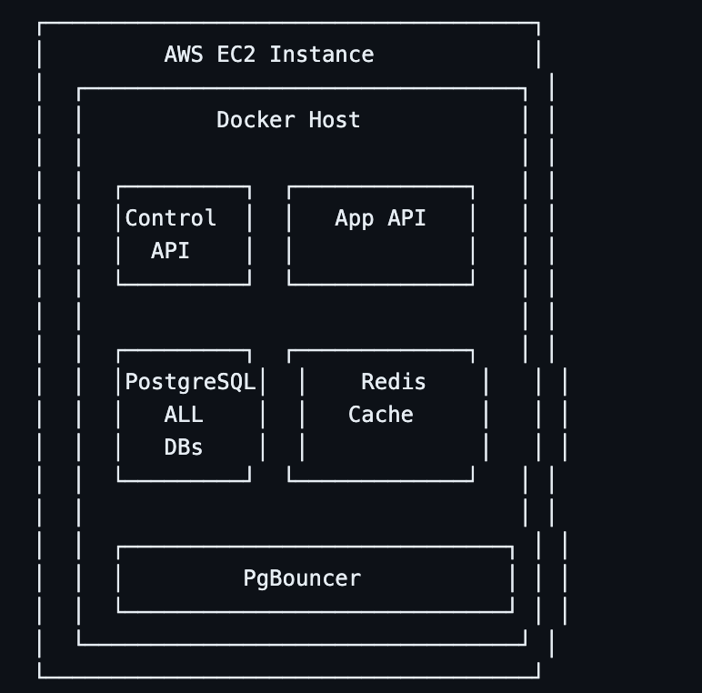

#!/bin/bash

# scripts/deploy-ec2.sh

# ════════════════════════════════════════════════════

# 🚀 DÉPLOIEMENT MVP SUR EC2

# ════════════════════════════════════════════════════

set -e

SERVER_IP=${1:-"your-ec2-ip"}
SERVER_USER=${2:-"ubuntu"}
KEY_PATH=${3:-"~/.ssh/your-key.pem"}

echo "🚀 Déploiement sur EC2: ${SERVER_IP}"

# ════════════════════════════════════════════════════

# 📦 1. PREPARATION DES FICHIERS

# ════════════════════════════════════════════════════

# Créer le package de déploiement

echo "📦 Création du package..."
tar -czf helpdeskly-deploy.tar.gz \
 docker-compose.prod.yml \
 .env.production \
 Dockerfile \
 dist/ \
 prisma/ \
 package.json \
 scripts/

# ════════════════════════════════════════════════════

# 🔄 2. TRANSFERT VERS EC2

# ════════════════════════════════════════════════════

echo "📤 Transfert vers EC2..."
scp -i ${KEY_PATH} helpdeskly-deploy.tar.gz ${SERVER_USER}@${SERVER_IP}:/tmp/

# ════════════════════════════════════════════════════

# ⚙️ 3. INSTALLATION SUR EC2

# ════════════════════════════════════════════════════

ssh -i ${KEY_PATH} ${SERVER_USER}@${SERVER_IP} << 'EOF'
set -e

echo "🔧 Installation des dépendances..."

# Mise à jour système

sudo apt update && sudo apt upgrade -y

# Installation Docker

if ! command -v docker &> /dev/null; then
curl -fsSL https://get.docker.com -o get-docker.sh
sudo sh get-docker.sh
sudo usermod -aG docker $USER
fi

# Installation Docker Compose

if ! command -v docker-compose &> /dev/null; then
sudo curl -L "https://github.com/docker/compose/releases/latest/download/docker-compose-$(uname -s)-$(uname -m)" -o /usr/local/bin/docker-compose
sudo chmod +x /usr/local/bin/docker-compose
fi

# Créer répertoire app

sudo mkdir -p /opt/helpdeskly
sudo chown $USER:$USER /opt/helpdeskly
cd /opt/helpdeskly

# Extraire les fichiers

tar -xzf /tmp/helpdeskly-deploy.tar.gz

echo "✅ Installation terminée"
EOF

# ════════════════════════════════════════════════════

# 🚢 4. DÉPLOIEMENT

# ════════════════════════════════════════════════════

ssh -i ${KEY_PATH} ${SERVER_USER}@${SERVER_IP} << 'EOF'
cd /opt/helpdeskly

echo "🚢 Démarrage des services..."

# Arrêter les anciens containers

docker-compose -f docker-compose.prod.yml down || true

# Démarrer les nouveaux

docker-compose -f docker-compose.prod.yml up -d

# Attendre que les services soient prêts

sleep 30

# Vérifier les services

echo "🏥 Vérification des services..."
curl -f http://localhost:6500/health && echo "✅ Control API: OK"
curl -f http://localhost:6501/health && echo "✅ App API: OK"

echo "🎉 Déploiement terminé!"
echo "🌐 Control API: http://${HOSTNAME}:6500"
echo "🌐 App API: http://${HOSTNAME}:6501"
EOF

echo "🎯 Déploiement EC2 terminé avec succès!"
